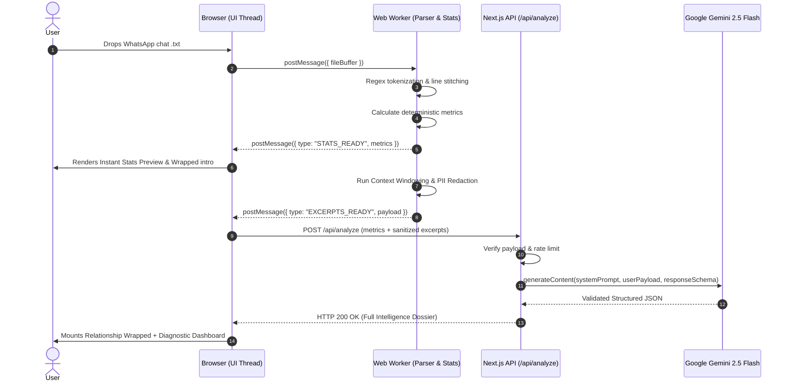

# DecodeUs — System Architecture & Technical Design

> **Document Version**: 1.0.0  
> **Target Stack**: Next.js 15+ (App Router, TypeScript), Web Workers, Tailwind CSS, Gemini 2.5 Flash via `@google/genai`  
> **Guiding Philosophy**: *"Analyze patterns, not people."*

---

## 1. High-Level Architecture Overview

DecodeUs is engineered as a **hybrid local-first conversation intelligence system**. It balances user privacy, instant client-side performance, and semantic AI reasoning by segregating deterministic computation from LLM analysis.

```
┌─────────────────────────────────────────────────────────────────────────────┐
│                            CLIENT (Browser / Web Worker)                    │
│                                                                             │
│  ┌──────────────────────┐      ┌─────────────────────────────────────────┐  │
│  │ WhatsApp Export .txt │ ───> │ Web Worker: Parse Engine                │  │
│  └──────────────────────┘      │ - Multi-format Regex Normalization      │  │
│                                │ - Multiline Message Stitching           │  │
│                                └────────────────────┬────────────────────┘  │
│                                                     │                       │
│                                                     ▼                       │
│  ┌───────────────────────────────────────────────────────────────────────┐  │
│  │ Web Worker: Deterministic Metrics Engine                              │  │
│  │ - Initiation ratios (3h silence window)                               │  │
│  │ - Median & average reply speeds                                       │  │
│  │ - Double-text bursts, active hours, emojis, question counts           │  │
│  └──────────────────┬───────────────────────────────┬────────────────────┘  │
│                     │                               │                       │
│                     ▼                               ▼                       │
│  ┌───────────────────────────────────┐  ┌────────────────────────────────┐  │
│  │ Instant Local Stats Preview       │  │ Context Windowing & Redaction  │  │
│  │ (Zero-latency UI render)          │  │ - PII Scrubbing (Regex)        │  │
│  └───────────────────────────────────┘  │ - Dynamic Tension Sampling     │  │
│                                         └───────────────┬────────────────┘  │
└─────────────────────────────────────────────────────────┼───────────────────┘
                                                          │ Sanitized Excerpts
                                                          │ + Deterministic Stats
                                                          ▼
┌─────────────────────────────────────────────────────────────────────────────┐
│                     SERVER-SIDE API PROXY (Next.js Route)                   │
│                                                                             │
│  ┌───────────────────────────────────────────────────────────────────────┐  │
│  │ Route Handler: /api/analyze                                           │  │
│  │ - Rate Limiting & Input Validation (Zod)                              │  │
│  │ - Ephemeral In-Memory Payload (Zero Disk/DB Persistence)              │  │
│  │ - Secure Gemini 2.5 Flash Calling (@google/genai)                     │  │
│  │ - Strict JSON Schema Enforcement (`responseSchema`)                   │  │
│  └──────────────────────────────────┬────────────────────────────────────┘  │
└─────────────────────────────────────┼───────────────────────────────────────┘
                                      │ Validated Structured Report
                                      ▼
┌─────────────────────────────────────────────────────────────────────────────┐
│                       REACTIVE PRESENTATION LAYER (UI)                      │
│                                                                             │
│  ┌───────────────────────────────────────────────────────────────────────┐  │
│  │ Swiss International UI & Presentation Modules                         │  │
│  │ ├─ Relationship Wrapped (6-Slide Framer Motion Story)                 │  │
│  │ ├─ Relationship Fingerprint (7-Dimension Diagnostic Grid)             │  │
│  │ ├─ Behavioral Signals (Green / Red / Mixed Signal Badges)             │  │
│  │ ├─ Pattern Replay (Cyclical Conflict & Escalation Loops)              │  │
│  │ ├─ Reality Check (Empirical Testing of User Insecurities)             │  │
│  │ ├─ Evidence Drawer (Direct Verifiable Excerpt Receipts)               │  │
│  │ └─ Ask Your Chat (Context-Grounded Natural Language Terminal)         │  │
│  └───────────────────────────────────────────────────────────────────────┘  │
└─────────────────────────────────────────────────────────────────────────────┘
```

---

## 2. Core Subsystems

### 2.1 Client-Side Parsing Pipeline (`parse.worker.ts`)

To support large chat files (up to 100,000+ messages) without locking the main browser UI thread, all parsing runs inside a dedicated **Web Worker**.

#### Multi-Locale Date & Time Regex Engine
WhatsApp exports vary dramatically by operating system (iOS vs. Android) and device regional settings:

1. **iOS Format** (enclosed in brackets):
   ```regex
   ^\[(\d{1,2}[\/.-]\d{1,2}[\/.-]\d{2,4}),?\s+(\d{1,2}:\d{2}(?::\d{2})?(?:\s*[APap][Mm])?)\]\s+([^:]+):\s+(.*)$
   ```
   *Example*: `[14/09/2026, 10:14:22 AM] Maya Lin: Are we still meeting at 4?`

2. **Android Format** (dash separator):
   ```regex
   ^(\d{1,2}[\/.-]\d{1,2}[\/.-]\d{2,4}),?\s+(\d{1,2}:\d{2}(?::\d{2})?(?:\s*[APap][Mm])?)\s+-\s+([^:]+):\s+(.*)$
   ```
   *Example*: `14/09/2026, 10:14 - Alex Rivera: Yes, leaving right now.`

3. **System / Metadata Messages**:
   - `Messages and calls are end-to-end encrypted...`
   - `<Media omitted>` / `image omitted` / `video omitted` / `sticker omitted`
   - `This message was deleted`
   System messages are flagged with `messageType: "system" | "media_omitted" | "deleted"` and segregated from conversational lexical metrics.

#### Multiline Message Stitching
Messages containing line breaks do not start with a timestamp header. The worker buffers lines until the next timestamp match, preserving newlines within `CanonicalMessage.text`.

---

### 2.2 Canonical Data Schema

The parser normalizes all incoming logs into a platform-agnostic schema:

```typescript
export interface CanonicalMessage {
  id: string;                      // Sequential index: "msg_00001"
  timestamp: string;               // ISO 8601 UTC: "2026-09-14T04:44:22.000Z"
  senderId: "person_a" | "person_b" | "system";
  originalSenderName: string;      // Scraped display name
  text: string;                    // Normalized message body
  messageType: "text" | "media_omitted" | "deleted" | "system";
  charCount: number;
  wordCount: number;
  hasQuestion: boolean;            // Ends with '?' or contains interrogative markers
  emojis: string[];                // Unicode emoji array
}

export interface ConversationMetadata {
  conversationId: string;
  senderA: { id: "person_a"; displayName: string };
  senderB: { id: "person_b"; displayName: string };
  totalMessages: number;
  startDate: string;
  endDate: string;
  totalDays: number;
}
```

---

### 2.3 Local Deterministic Metrics Engine

The deterministic engine computes mathematical indicators entirely in-browser without sending raw chats to the server:

```
Deterministic Metrics Suite
├── 1. Temporal & Activity Analysis
│   ├── Total messages & percentage share per participant
│   ├── Messages per hour (24-bucket circadian heatmap)
│   ├── Messages per day of week (7-bucket distribution)
│   └── Weekly volume trends over time
│
├── 2. Conversation Initiation & Sessions
│   ├── Session Boundary Rule: Silence delta Δt ≥ 180 minutes (3 hours)
│   ├── Initiation Count & Percentage per participant
│   └── Follow-up initiation rate after long silences (>24 hours)
│
├── 3. Response Dynamics & Latency
│   ├── Average response latency (seconds)
│   ├── Median response latency (robust against overnight sleep gaps)
│   ├── Response latency distribution (<1m, 1-5m, 5-30m, 30m-2h, 2h+)
│   └── Longest conversation exchange (message count)
│
├── 4. Conversational Effort & Density
│   ├── Average and median characters/words per message
│   ├── Double-text burst frequency (≥2 consecutive messages without reply)
│   ├── Questions asked & question response rate
│   └── Top 10 emojis and top recurring phrases per participant
```

#### Algorithm: Initiation and Session Calculation
```typescript
const SESSION_GAP_THRESHOLD_MS = 3 * 60 * 60 * 1000; // 3 hours

export function calculateInitiations(messages: CanonicalMessage[]) {
  let lastTimestamp = 0;
  const initiations = { person_a: 0, person_b: 0 };

  for (const msg of messages) {
    if (msg.messageType !== "text") continue;
    const currentTimestamp = new Date(msg.timestamp).getTime();

    if (lastTimestamp === 0 || currentTimestamp - lastTimestamp >= SESSION_GAP_THRESHOLD_MS) {
      if (msg.senderId === "person_a") initiations.person_a++;
      if (msg.senderId === "person_b") initiations.person_b++;
    }
    lastTimestamp = currentTimestamp;
  }

  const total = initiations.person_a + initiations.person_b;
  return {
    person_a_count: initiations.person_a,
    person_b_count: initiations.person_b,
    person_a_ratio: total > 0 ? initiations.person_a / total : 0.5,
    person_b_ratio: total > 0 ? initiations.person_b / total : 0.5,
  };
}
```

---

### 2.4 Context Windowing & Excerpt Extraction Engine

Full chat exports can exceed 500,000 tokens. Sending the entire chat to an LLM is slow, cost-prohibitive, and risks hallucination over excessive context.

DecodeUs uses an **Intelligent Sliding Window Sampler** to generate a targeted excerpt payload:

```
Raw Chat (50,000 lines)
          ↓
[Heuristic Trigger Scanner]
  ├─ High Delays: Silence > 12h followed by immediate terse reply
  ├─ Double-Text Bursts: ≥ 4 consecutive messages from one person
  ├─ Conflict Lexicon: Matches conflict tokens ("listen", "always", "never", "sorry", "upset")
  ├─ Emotional Disclosures: Lengthy messages (> 60 words) + question mark
  └─ Random Chronological Anchor Samples (1 per calendar month)
          ↓
[Context Window Assembler]
  Extract 10 messages before trigger + 10 messages after trigger
          ↓
[PII Redaction Engine]
  Mask phone numbers, emails, addresses, credit cards, and map real names to "Person A" / "Person B"
          ↓
Compact AI Ingestion Payload (~8,000 - 16,000 tokens)
```

---

### 2.5 Gemini 2.5 Flash Structured Analysis Pipeline

All semantic reasoning is delegated to **Gemini 2.5 Flash** executed via the official `@google/genai` SDK on the server side.

#### Server Route: `POST /api/analyze`
```typescript
import { GoogleGenAI, Type } from "@google/genai";

const ai = new GoogleGenAI({ apiKey: process.env.GEMINI_API_KEY });

// Enforce strict output schema matching our TypeScript types
const analysisResponseSchema = {
  type: Type.OBJECT,
  properties: {
    fingerprint: {
      type: Type.OBJECT,
      properties: {
        communication: { type: Type.INTEGER, description: "Score 0-100" },
        emotionalReciprocity: { type: Type.INTEGER, description: "Score 0-100" },
        conflictHandling: { type: Type.INTEGER, description: "Score 0-100" },
        effortBalance: { type: Type.INTEGER, description: "Score 0-100" },
        affection: { type: Type.INTEGER, description: "Score 0-100" },
        consistency: { type: Type.INTEGER, description: "Score 0-100" },
        boundaries: { type: Type.INTEGER, description: "Score 0-100" },
        summary: { type: Type.STRING }
      },
      required: ["communication", "emotionalReciprocity", "conflictHandling", "effortBalance", "affection", "consistency", "boundaries", "summary"]
    },
    signals: {
      type: Type.ARRAY,
      items: {
        type: Type.OBJECT,
        properties: {
          id: { type: Type.STRING },
          type: { type: Type.STRING, enum: ["GREEN", "RED", "AMBER"] },
          title: { type: Type.STRING },
          description: { type: Type.STRING },
          confidence: { type: Type.STRING, enum: ["HIGH", "MODERATE", "LOW", "INSUFFICIENT_EVIDENCE"] },
          occurrences: { type: Type.INTEGER },
          evidenceExcerptIds: { type: Type.ARRAY, items: { type: Type.STRING } },
          recommendation: { type: Type.STRING }
        },
        required: ["id", "type", "title", "description", "confidence", "occurrences", "evidenceExcerptIds", "recommendation"]
      }
    },
    patternLoops: {
      type: Type.ARRAY,
      items: {
        type: Type.OBJECT,
        properties: {
          id: { type: Type.STRING },
          name: { type: Type.STRING },
          sequence: { type: Type.ARRAY, items: { type: Type.STRING } },
          occurrencesCount: { type: Type.INTEGER },
          typicalResolution: { type: Type.STRING }
        },
        required: ["id", "name", "sequence", "occurrencesCount", "typicalResolution"]
      }
    },
    realityChecks: {
      type: Type.ARRAY,
      items: {
        type: Type.OBJECT,
        properties: {
          userAssumption: { type: Type.STRING },
          observedData: { type: Type.STRING },
          verdict: { type: Type.STRING },
          explanation: { type: Type.STRING }
        },
        required: ["userAssumption", "observedData", "verdict", "explanation"]
      }
    }
  },
  required: ["fingerprint", "signals", "patternLoops", "realityChecks"]
};
```

---

### 2.6 Vectorless Context Retrieval for "Ask Your Chat"

To provide fast, cost-effective natural language Q&A without running an expensive vector database:

```
User Query: "Who apologizes first after an argument?"
                         │
                         ▼
          ┌──────────────────────────────┐
          │ Lexical & Semantic Matcher   │
          │ Scans canonical log for:     │
          │ "sorry", "apologize", "my    │
          │ fault", "forgive", "regret"  │
          └──────────────┬───────────────┘
                         │ Top 5-8 matching dialogue segments (±5 messages)
                         ▼
          ┌──────────────────────────────┐
          │ Grounded Gemini Prompt       │
          │ Prompt + Extracted Dialogue  │
          │ Enforce: Evidence-backed only│
          └──────────────┬───────────────┘
                         │
                         ▼
          Streaming Answer with Citations:
          "Person A apologized first in 6 out of 8 detected conflict resolutions (75%)."
```

---

## 3. End-to-End Sequence Diagram



---

## 4. Performance & Non-Functional Requirements

| Metric | Target | Technical Mechanism |
| :--- | :--- | :--- |
| **Parsing Throughput** | < 1.5s for 50,000 lines | Off-thread Web Worker using optimized regex compilation |
| **Time to First Visual** | < 300ms | Deterministic stats render instantly while AI is processing |
| **AI Inference Latency** | < 4.0s | Gemini 2.5 Flash with compressed context windowing (<12k tokens) |
| **Memory Footprint** | < 80MB peak RAM | Stream-reading file slices, discarding raw strings after normalization |
| **Privacy Guarantee** | Zero disk storage | Chat never touches disk or persistent DB; ephemeral RAM buffer only |
| **Network Payload** | < 250KB | Only compressed JSON metrics and selected dialogue excerpts transmitted |
