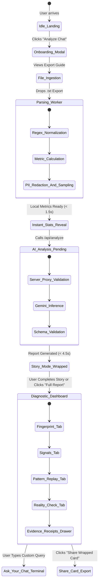

# DecodeUs — User & Developer Workflows

> **Document Version**: 1.0.0  
> **Status**: Approved Master Specification  
> **Target Stack**: Next.js 15+ (App Router), TypeScript, Web Workers, Vitest, Playwright, Vercel

---

## 1. User Journey & State Machine

The DecodeUs user journey is structured to deliver immediate gratification through local statistical insights while the deeper, LLM-powered semantic analysis runs asynchronously.



---

## 2. Detailed User Flow Phases

### Phase 1: Discovery & Education
1. **Landing Canvas**:
   - High-contrast Swiss International layout with an asymmetrical grid.
   - Core value proposition clearly visible: *"Understand what your relationship actually looks like through your conversations. Analyze patterns, not people."*
   - Interactive privacy promise badge: *"100% Client-Side Ingestion. Zero Raw Chat Storage."*
2. **Export Guide Modal**:
   - Interactive visual toggle for **iOS** and **Android** instructions:
     - *iOS*: Open Chat → Tap Contact Name → Scroll Down → Tap "Export Chat" → Select "Without Media".
     - *Android*: Open Chat → Tap `⋮` (Menu) → More → "Export Chat" → Select "Without Media".
   - Drag-and-drop dropzone with file format verification (`.txt` only, file size checked up to 50MB).

### Phase 2: In-Browser Ingestion & Instant Reveal
1. **Web Worker Execution**:
   - File is parsed off-thread in `parse.worker.ts`.
   - Real-time progress bar (0% → 100%) tracking regex line processing.
2. **Deterministic "Instant Stats" Preview**:
   - As soon as the worker finishes (typically < 1.5s), the UI displays instantaneous empirical stats:
     - Total messages exchanged and date range.
     - Initiation split percentages (e.g., *You: 58% / Partner: 42%*).
     - Median reply speeds (e.g., *You: 4m / Partner: 18m*).
     - Busiest chat day and peak circadian messaging hour.
   - A subtle Swiss Red progress indicator shows: *"Generating deep behavioral intelligence with Gemini..."*

### Phase 3: Relationship Wrapped (Story Mode)
A 6-slide, full-screen, mobile-friendly interactive story flow inspired by Spotify Wrapped, navigated via keyboard arrows, tap/click, or touch swipe:

- **Slide 01: The Volume**: Total messages, words, and longest continuous talking marathon.
- **Slide 02: The Initiative**: Who starts conversations, silence breaker stats, and follow-up ratios.
- **Slide 03: The Rhythm**: Circadian 24-hour clock visualizer showing peak texting hours and busiest days.
- **Slide 04: The Lexicon**: Signature emojis, top idiosyncratic catchphrases, and question counts.
- **Slide 05: The Signals**: Highlight of the top detected **Green Flag** and biggest **Mixed Signal**.
- **Slide 06: The Fingerprint Dossier**: Complete radar/matrix visualization with an action button to enter the **Deep Diagnostic Dashboard**.

### Phase 4: Deep Diagnostic Dashboard
A dense, multi-tab analytical interface engineered around Swiss International grid tenets:

1. **Relationship Fingerprint**:
   - 7 diagnostic scores (0-100): *Communication, Emotional Reciprocity, Conflict Handling, Effort Balance, Affection, Consistency, Boundaries*.
   - Objective behavioral commentary explaining each dimension.
2. **Signals & Flags**:
   - Color-coded badges: Green (`swiss-green`), Red (`swiss-accent`), Amber (`swiss-amber`).
   - Categorized by severity, confidence (*High / Moderate / Low*), and occurrence counts.
3. **Pattern Replay**:
   - Step-by-step cyclical loops (e.g., *Trigger → Deflection → Defensive Escalation → Truce → Recurrence*).
4. **Reality Check**:
   - User types an insecurity or selects common assumptions (e.g., *"Are they pulling away?"*).
   - Empirical data comparison testing the perception against historical initiation and message density trends.
5. **Evidence Mode (Drawer)**:
   - Clicking any finding slides open an evidence drawer showing exact dates and anonymized excerpt receipts.

### Phase 5: "Ask Your Chat" & Export
1. **Context-Grounded Q&A Terminal**:
   - Fast, vectorless RAG search over anonymized chat logs answering specific behavioral questions:
     - *"Who tends to apologize first?"*
     - *"What triggers our longest silences?"*
     - *"How has our texting changed over the last 6 months?"*
2. **Branded Shareable Card Export**:
   - Generates a zero-PII, high-aesthetic `.png` card (via `html-to-image`) formatted for Instagram Stories (9:16) or Twitter/X (16:9).
   - Contains only statistical fingerprints and flag badges, never personal names, phone numbers, or private dialogue.

---

## 3. Edge Cases & Error Recovery Workflows

```
┌─────────────────────────────┬────────────────────────────────────────────────────────┐
│ Edge Case Condition         │ Fallback & Remediation Workflow                        │
├─────────────────────────────┼────────────────────────────────────────────────────────┤
│ Non-WhatsApp / Binary File  │ Client worker detects invalid headers. Rejects with    │
│                             │ explicit error: "Unsupported file format. Please       │
│                             │ upload a WhatsApp .txt chat export."                   │
├─────────────────────────────┼────────────────────────────────────────────────────────┤
│ Single-Participant Export   │ Parser detects sender count = 1 (notes-to-self chat).  │
│                             │ Halts pipeline: "Only 1 participant detected.          │
│                             │ DecodeUs requires a 2-person conversation."            │
├─────────────────────────────┼────────────────────────────────────────────────────────┤
│ Extreme Skew (> 95% 1 User) │ Continues with banner note: "Highly unbalanced         │
│                             │ conversation sample. Certain reciprocity metrics will  │
│                             │ indicate insufficient bilateral evidence."             │
├─────────────────────────────┼────────────────────────────────────────────────────────┤
│ Non-Standard Date Format    │ Parser cycles through 6 known international date/time  │
│                             │ regex heuristics before flagging parsing failure.      │
├─────────────────────────────┼────────────────────────────────────────────────────────┤
│ Gemini Rate Limit (HTTP 429)│ Server proxy executes exponential backoff (1s, 2s, 4s).│
│                             │ If exhausted, renders deterministic report with notice:│
│                             │ "AI reasoning temporarily busy; showing metrics only." │
├─────────────────────────────┼────────────────────────────────────────────────────────┤
│ Sensitive/Crisis Keywords   │ Automated detection of self-harm or domestic violence  │
│                             │ keywords triggers non-judgmental crisis helpline card. │
└─────────────────────────────┴────────────────────────────────────────────────────────┘
```

---

## 4. Developer & Engineering Workflows

### 4.1 Branching Strategy & Git Protocol

```
main (Production: Vercel auto-deploy)
 │
 ├── staging (Pre-release testing & validation)
 │    │
 │    ├── feature/parser-worker-optimization
 │    ├── feature/swiss-wrapped-story-flow
 │    └── fix/android-date-regex-edge-cases
```

- **Branch Naming**:
  - `feature/<kebab-case-description>`
  - `fix/<kebab-case-bug>`
  - `docs/<documentation-update>`
  - `refactor/<refactoring-scope>`
- **Commit Messages**: Strictly follow **Conventional Commits**:
  - `feat(parser): add support for 24-hour bracketed iOS WhatsApp exports`
  - `fix(metrics): resolve median calculation for even-numbered message arrays`
  - `style(ui): enforce 0px border-radius on story cards`
  - `test(anonymizer): add unit tests for phone number scrubbing regex`

---

### 4.2 Synthetic Data Policy (Mandatory Privacy Rule)

> [!CAUTION]
> **NEVER COMMIT REAL CHAT LOGS INTO SOURCE CONTROL.**  
> Real WhatsApp exports contain private telephone numbers, home addresses, financial disclosures, and intimate messages. Committing real chat logs to Git is an immediate security breach.

All unit tests, integration tests, and UI demos must use **synthetic chat fixtures** located in `tests/fixtures/synthetic/`:

- `synthetic-balanced-couple.txt` (Healthy communication, balanced initiation).
- `synthetic-high-conflict.txt` (Escalation loops, repeated guilt trips).
- `synthetic-avoidant-pursuer.txt` (One double-texter, one long-delay replier).
- `synthetic-multiline-ios.txt` (iOS bracketed format with line breaks).
- `synthetic-android-24h.txt` (Android dash format with 24-hour clock).

A helper generation script is provided:
```bash
npm run test:generate-fixture -- --type=avoidant --messages=1000
```

---

### 4.3 Testing Strategy & Quality Gates

```
Test Pyramid for DecodeUs
├── Unit Tests (Vitest)
│   ├── tests/unit/parser.test.ts          → Multi-locale regex, multi-line stitching
│   ├── tests/unit/metrics.test.ts         → Initiation, median latency, double texts
│   ├── tests/unit/anonymizer.test.ts      → PII scrubbing, email/phone masking
│   └── tests/unit/windowing.test.ts       → Excerpt sampling & token budgeting
│
├── Integration Tests (Vitest / MSW)
│   ├── tests/integration/api-analyze.test.ts  → Route handler validation & mocking
│   └── tests/integration/schema.test.ts       → Gemini responseSchema conformity
│
└── End-to-End Tests (Playwright)
    ├── tests/e2e/upload-and-wrapped.spec.ts   → Full user flow with synthetic fixture
    └── tests/e2e/accessibility.spec.ts        → WCAG 2.1 AA keyboard/screen reader
```

#### Running Tests Locally
```bash
# Run all unit and integration tests
npm run test

# Run tests in watch mode
npm run test:watch

# Run end-to-end tests with Playwright
npm run test:e2e

# Run linter and type-check
npm run lint && npm run type-check
```

---

### 4.4 Continuous Integration & Deployment (CI/CD)

The GitHub Actions workflow runs on every Pull Request targeting `main` or `staging`:

```yaml
name: CI Quality Gate
on: [push, pull_request]

jobs:
  validate:
    runs-on: ubuntu-latest
    steps:
      - uses: actions/checkout@v4
      - uses: actions/setup-node@v4
        with:
          node-version: 20
          cache: 'npm'
      - run: npm ci
      - run: npm run lint
      - run: npm run type-check
      - run: npm run test:coverage
      - name: Check for PII or Real Data in Fixtures
        run: npm run test:leak-check
```

Deployments are handled automatically via **Vercel**:
- Every push to `staging` deploys an ephemeral preview environment.
- Merges to `main` deploy directly to production with zero downtime.
